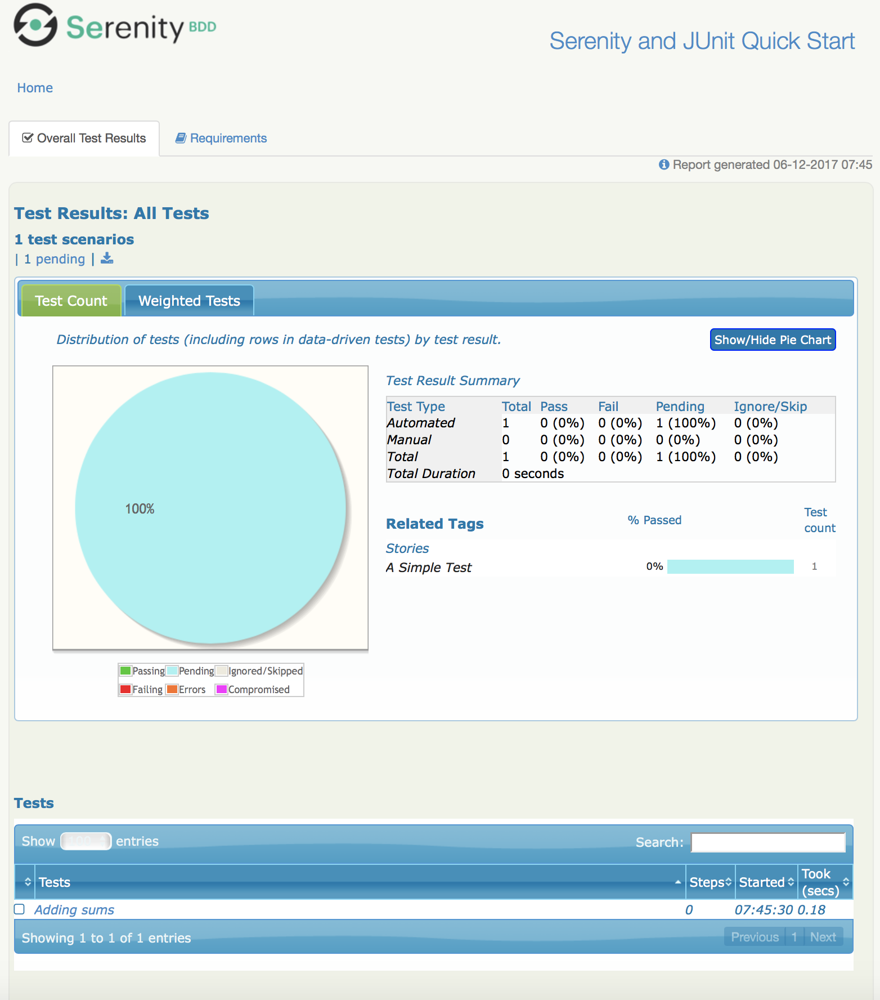

== First Steps with Serenity BDD

In this section, we will help you get going with your first Serenity BDD project. We will be using the simplest of all Serenity BDD setups - Serenity with pure JUnit. Later on, you will learn how to use Serenity with BDD tools like Cucumber and JBehave, and also the powerful Screenplay plugin. But let's start with something simple.

=== What you need to start

==== Java 8
Test Automation is a development activity, so you will need some familiarity with Java. Serenity BDD uses Java 8, so make sure you have a [JDK 1.8 or later](http://www.oracle.com/technetwork/java/javase/downloads/index.html) installed.

==== An Integrated Development Environment

You will need a modern IDE to work with Java. We recommend IntelliJ (you can download the Community Edition, which is free, [from here](https://www.jetbrains.com/idea/download). But Eclipse will work fine as well.

==== A Build Tool

You will also need a build tool, either Gradle or Maven, to run your tests and generate your reports. Make sure you have either [Gradle 3.x or higher](http://www.gradle.org/downloads) or [Maven 3.3.x or higher](https://maven.apache.org/download.cgi) installed.

=== Getting Started

The quickest way to create a new project is to take one of the starter projects on Github. You can find the starter project for JUnit at [https://github.com/serenity-bdd/serenity-junit-starter](https://github.com/serenity-bdd/serenity-junit-starter).

You can clone this repository:

----
git clone https://github.com/serenity-bdd/serenity-junit-starter.git
cd serenity-junit-starter
----

Or simply [download a zip file from here](https://github.com/serenity-bdd/serenity-junit-starter/archive/master.zip).

If you are using Maven, you can also create a new project using one of the Serenity [Maven Archetypes](https://maven.apache.org/guides/introduction/introduction-to-archetypes.html).

=== So far so good?

The starter project comes with a demo test that you can run. From the command line, run either

----
$ mvn clean verify
----

or

----
$gradle clean test
----

This should produce something like the following:

----
gradle clean test

> Task :test

starter.ASimpleTest STANDARD_OUT
    23:14:22.434 [Test worker] INFO  net.serenitybdd.core.Serenity -

    -------------------------------------------------------------------------------------
         _______. _______ .______       _______ .__   __.  __  .___________.____    ____
        /       ||   ____||   _  \     |   ____||  \ |  | |  | |           |\   \  /   /
       |   (----`|  |__   |  |_)  |    |  |__   |   \|  | |  | `---|  |----` \   \/   /
        \   \    |   __|  |      /     |   __|  |  . `  | |  |     |  |       \_    _/
    .----)   |   |  |____ |  |\  \----.|  |____ |  |\   | |  |     |  |         |  |
    |_______/    |_______|| _| `._____||_______||__| \__| |__|     |__|         |__|

     News and tutorials at http://www.serenity-bdd.info
     Documentation at https://wakaleo.gitbooks.io/the-serenity-book/content/
     Join the Serenity Community on Rocket Chat at https://serenity-bdd.rocket.chat
     Serenity BDD Support and Training at http://serenity-bdd.info/#/trainingandsupport
     Learn Serenity BDD online at http://serenity-dojo.com
    -------------------------------------------------------------------------------------

starter.ASimpleTest > addingSums STANDARD_OUT
    23:14:22.544 [Test worker] INFO  net.serenitybdd.core.Serenity - Test Suite Started: A simple test
    23:14:22.628 [Test worker] INFO  net.serenitybdd.core.Serenity -
     _____ _____ ____ _____   ____ _____  _    ____ _____ _____ ____
    |_   _| ____/ ___|_   _| / ___|_   _|/ \  |  _ \_   _| ____|  _ \
      | | |  _| \___ \ | |   \___ \ | | / _ \ | |_) || | |  _| | | | |
      | | | |___ ___) || |    ___) || |/ ___ \|  _ < | | | |___| |_| |
      |_| |_____|____/ |_|   |____/ |_/_/   \_\_| \_\|_| |_____|____/

    TEST STARTED: addingSums
    -------------------------------------------------------------------
    23:14:22.628 [Test worker] INFO  net.serenitybdd.core.Serenity - TEST NUMBER: 1

starter.ASimpleTest STANDARD_OUT
    23:14:22.918 [Test worker] INFO  net.serenitybdd.core.Serenity -
            __    _____ _____ ____ _____   ____   _    ____  ____  _____ ____
      _     \ \  |_   _| ____/ ___|_   _| |  _ \ / \  / ___|/ ___|| ____|  _ \
     (_)_____| |   | | |  _| \___ \ | |   | |_) / _ \ \___ \\___ \|  _| | | | |
      _|_____| |   | | | |___ ___) || |   |  __/ ___ \ ___) |___) | |___| |_| |
     (_)     | |   |_| |_____|____/ |_|   |_| /_/   \_\____/|____/|_____|____/
            /_/

    TEST PASSED: Adding sums
    ----------------------------------------------------------------------------

> Task :aggregate
Generating Serenity Reports for serenity-junit-starter to directory /Users/john/Projects/OpenSource/serenity-junit-starter/target/site/serenity

BUILD SUCCESSFUL in 4s
6 actionable tasks: 6 executed
----

Take a look in the `target/site/serenity` directory. You should find an index.html file, which will be the home page of the Serenity Reports

[[fig-aggregate-report]]
.An aggregate report generated by Serenity

=== The project structure

Now import the project into your IDE (be sure to import the project as a Maven or Gradle project). The project structure looks something like this (some less interesting files and directories have been left out):

[source]
----
├── pom.xml                                 // <1>
├── build.gradle                            // <2>
├── src
|   ├── main
|   ├── test                                // <3>
|       ├── java
|           ├── starter                     // <4>
|               ├── ASimpleTest.java        // <5>
|               ├── steps                   // <6>
|                   ├── MathWizSteps.java   // <7>

 ----
<1> Maven POM file
<2> Gradle build script
<3> Test code
<4> Root package
<5> A sample test case
<6> Step library package
<7> A sample step library

To personalise this project, just rename the `starter` package into one that represents the root package for your own project. You can also delete the sample test and step library, though you might want to have a look at them to get a first taste of Serenity code.

=== Your first test

---------------
